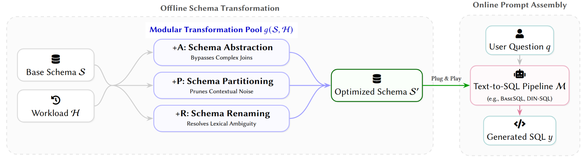
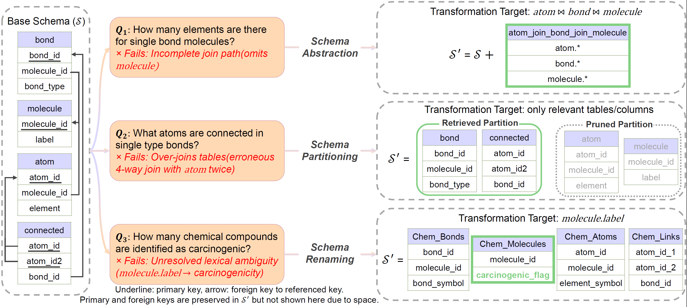

# Logical-Database-Design

## The Case for Text-to-SQL Friendly Logical Database Design

NL2SQL pipelines fail in predictable, structural ways: they miss join paths,
over-join irrelevant tables, and misread cryptic identifiers. This work treats
the schema itself as a tuning target — given a base schema 𝒮 and a workload 𝓗
of question/SQL pairs, an **offline schema transformation** step produces an
optimized schema 𝒮′ that any off-the-shelf text-to-SQL pipeline can consume
unchanged.

Three composable transformations cover the three failure modes:

- **Schema Abstraction** (+A, `--view`) — pre-computed multi-table views that
  let the model bypass complex joins
- **Schema Partitioning** (+P, `--cluster`) — workload-mined table clusters
  that prune contextual noise from the prompt schema
- **Schema Renaming** (+R, `--rename`) — LLM-rewritten table/column names that
  resolve lexical ambiguity between question and schema

Each transformation targets a specific class of failure on the base schema 𝒮.
Worked examples on the BIRD chemistry schema — incomplete join path, erroneous
over-join, and lexical ambiguity — together with the matching mitigation:

---

## Paper

[The Case for Text-to-SQL Friendly Logical Database Design (arXiv:2606.03145)](https://arxiv.org/abs/2606.03145)

## Code

The repository ships the paper's question splits and its optimized schema, so
the experiments run without any LLM schema-prep calls. Five text-to-SQL
pipelines are included: BaseSQL, DIN-SQL, MAC-SQL, CSC-SQL and AutoLink.

- [`benchmarks/README.md`](benchmarks/README.md) — start here: build the
  database with the paper's schema, run a pipeline, and notes for each pipeline
- [`benchmarks/PREP_DATABASE.md`](benchmarks/PREP_DATABASE.md) — how the
  database and the optimized schema are built, what the shipped files contain,
  and how to build an optimized schema for your own database
